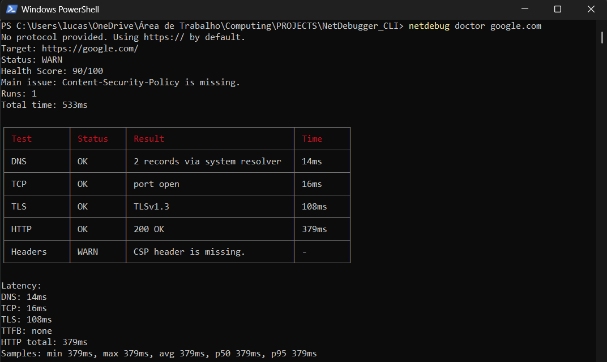
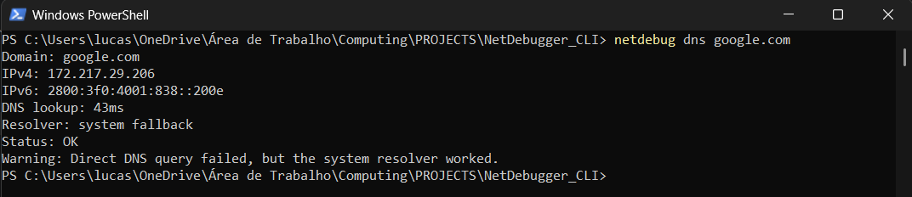
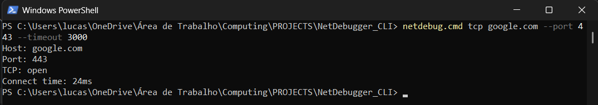
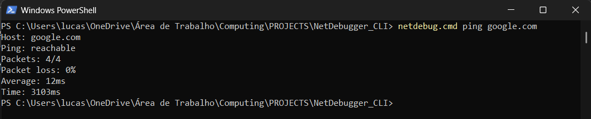
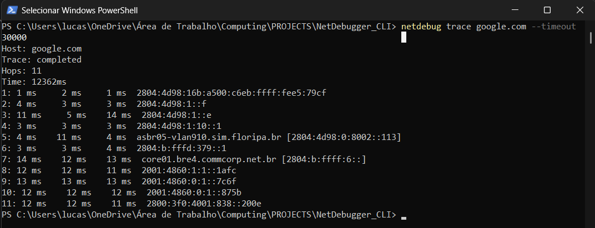

# NetDebugger CLI

NetDebugger CLI is a TypeScript command-line diagnostic tool for debugging
network, HTTP, TLS, DNS, latency, and security-header problems from the
terminal.

Instead of returning only low-level errors such as `ECONNREFUSED`,
`ENOTFOUND`, or `ETIMEDOUT`, NetDebugger runs layered probes and turns the
results into a readable diagnosis with timings, health score, findings, and
actionable recommendations.

## The Problem

When an API or website fails, the first question is usually:

> Is this DNS, TCP, TLS, HTTP, latency, headers, firewall, or the backend?

Most debugging workflows require jumping between `ping`, `tracert`, `curl`,
browser devtools, certificate viewers, logs, and custom scripts. NetDebugger
puts those checks behind one CLI, keeps the output consistent, and can also
export JSON for automation.

## Features

- Full `doctor` workflow across DNS, TCP, TLS, HTTP, headers, latency, and
  diagnosis.
- DNS resolver that tries direct `resolve4`/`resolve6` first, then falls back
  to the operating system resolver when direct DNS is blocked.
- TCP port checks using native sockets.
- TLS handshake inspection with certificate issuer, subject, validity, TLS
  version, cipher, and expiration warnings.
- HTTP/HTTPS request diagnostics with status code, redirects, headers, and
  total response time.
- Common header analysis for content type, cache, cookies, server exposure,
  and redirect location.
- Security header analysis for CSP, HSTS, X-Frame-Options,
  X-Content-Type-Options, Referrer-Policy, and Permissions-Policy.
- Latency summaries with min, max, average, p50, and p95 over repeated runs.
- Diagnosis engine that converts raw probe failures into likely causes and
  recommendations.
- Health score for quick status classification.
- Console, table, and JSON reporters.
- `compare` mode for staging vs production checks.
- `watch` mode for repeated monitoring.
- Platform adapters for Windows, Linux, and macOS command differences.

## Technical Highlights

- Built a modular CLI architecture using TypeScript and Commander.
- Implemented DNS resolution using Node.js `dns/promises`, including system
  resolver fallback for Windows/VPN/firewall edge cases.
- Created TCP socket probes using the native `net` module.
- Implemented TLS certificate inspection using Node.js `tls`.
- Implemented HTTP diagnostics with native `http` and `https` clients.
- Measured request latency across DNS, TCP, TLS, and HTTP layers.
- Built a diagnosis engine to convert low-level probe results into actionable
  explanations.
- Added health scoring to classify targets as `OK`, `WARN`, or `ERROR`.
- Added JSON export for CI/CD, logs, and automation.
- Isolated external commands behind adapters so `ping`, `tracert`, and
  `traceroute` stay testable.
- Added unit tests with mocked probes, local servers, fake sockets, and injected
  command output to avoid depending on the public internet.

## Technologies

- TypeScript
- Node.js
- Commander
- cli-table3
- chalk
- Native Node modules: `dns/promises`, `net`, `tls`, `http`, `https`,
  `child_process`
- Node's native test runner

## Architecture

NetDebugger is organized as layered modules:

```text
src/
  cli.ts                 # Commander program assembly
  main.ts                # Executable entry point
  commands/              # CLI input parsing and command handlers
  services/              # Multi-step orchestration, mainly doctor.service.ts
  probes/                # Raw network checks: DNS, TCP, TLS, HTTP, ping, trace
  analyzers/             # Interpretation: headers, TLS, latency, diagnosis
  adapters/              # Platform and external command boundaries
  output/                # Console, table, and JSON reporters
  core/                  # Shared types, result envelope, and domain errors
```

The design separates measurement from interpretation:

- Probes collect facts.
- Analyzers classify those facts.
- Services orchestrate the workflow.
- Reporters render the final result.
- Core modules keep shared contracts stable.

Every probe returns the same result envelope:

```ts
{
  status: "ok",
  target: "google.com",
  durationMs: 32,
  data: {},
  error: null
}
```

That shared shape keeps tests, reports, JSON output, and diagnosis logic
consistent.

## Installation

Clone the repository and install dependencies:

```powershell
git clone <repository-url>
cd NetDebugger_CLI
npm.cmd install
```

Build the project:

```powershell
npm.cmd run build
```

Link the CLI locally:

```powershell
npm.cmd link
```

On PowerShell, use `netdebug.cmd` if script execution policy blocks
`netdebug.ps1`.

```powershell
netdebug.cmd --help
```

## Development

Run typecheck:

```powershell
npm.cmd run typecheck
```

Run the test suite:

```powershell
npm.cmd test
```

Run the compiled CLI without linking:

```powershell
node dist/main.js doctor https://google.com
```

## Usage

Run the complete diagnostic workflow:

```powershell
netdebug.cmd doctor https://google.com
```

You can also pass a host without protocol. NetDebugger uses HTTPS by default:

```powershell
netdebug.cmd doctor google.com
```

Useful doctor options:

```powershell
netdebug.cmd doctor https://google.com --headers
netdebug.cmd doctor https://google.com --verbose
netdebug.cmd doctor https://google.com --json
netdebug.cmd doctor https://google.com --json --output report.json
netdebug.cmd doctor https://google.com --runs 10
netdebug.cmd doctor https://google.com --timeout 3000
netdebug.cmd doctor https://google.com --trace
netdebug.cmd doctor https://google.com --no-color
```

Run focused probes:

```powershell
netdebug.cmd dns google.com
netdebug.cmd tcp google.com --port 443
netdebug.cmd tls https://google.com
netdebug.cmd http https://google.com
netdebug.cmd ping google.com
netdebug.cmd trace google.com --timeout 30000
```

Compare two targets:

```powershell
netdebug.cmd compare https://staging.example.com https://api.example.com
```

Watch a target over time:

```powershell
netdebug.cmd watch https://google.com --interval 30
```

## Example Output

### Doctor

```text
No protocol provided. Using https:// by default.
Target: https://google.com/
Status: WARN
Health Score: 90/100
Main issue: Content-Security-Policy is missing.
Runs: 1
Total time: 526ms

┌────────────┬──────────┬────────────────────────────────┬──────────┐
│ Test       │ Status   │ Result                         │ Time     │
├────────────┼──────────┼────────────────────────────────┼──────────┤
│ DNS        │ OK       │ 2 records via system resolver  │ 17ms     │
│ TCP        │ OK       │ port open                      │ 16ms     │
│ TLS        │ OK       │ TLSv1.3                        │ 103ms    │
│ HTTP       │ OK       │ 200 OK                         │ 384ms    │
│ Headers    │ WARN     │ CSP header is missing.         │ -        │
└────────────┴──────────┴────────────────────────────────┴──────────┘

Latency:
DNS: 17ms
TCP: 16ms
TLS: 103ms
HTTP total: 384ms
Samples: min 384ms, max 384ms, avg 384ms, p50 384ms, p95 384ms
```

### DNS Fallback

```text
Domain: google.com
IPv4: 172.217.162.14
IPv6: 2800:3f0:4001:80b::200e
DNS lookup: 20ms
Resolver: system fallback
Status: OK
Warning: Direct DNS query failed, but the system resolver worked.
```

### JSON Mode

```json
{
  "target": "https://google.com/",
  "status": "warn",
  "score": 90,
  "dns": {
    "status": "ok"
  },
  "tcp": {
    "status": "ok"
  },
  "tls": {
    "status": "ok"
  },
  "http": {
    "status": "ok"
  },
  "mainIssue": "Content-Security-Policy is missing.",
  "diagnosis": []
}
```

## Screenshots

### Doctor



### DNS



### TCP



### Ping



### Trace



## Commands

```text
netdebug doctor <url>
netdebug compare <leftUrl> <rightUrl>
netdebug dns <domain>
netdebug tcp <host> --port <port>
netdebug tls <target>
netdebug http <url>
netdebug ping <host>
netdebug trace <host>
netdebug watch <url>
```

## Roadmap

- Improve Windows traceroute performance with faster `tracert` defaults such as
  disabled reverse lookup and per-hop timeout controls.
- Add optional integration tests under `tests/integration`.
- Add richer JSON schema documentation.
- Add report persistence formats beyond JSON, such as Markdown or HTML.
- Add more precise HTTP timing, including time to first byte.
- Add retry policies for transient network failures.
- Add CI examples using `netdebug doctor --json`.
- Add release packaging and npm publishing workflow.

## What I Learned Building This

- Network failures are layered. A useful tool must distinguish DNS, TCP, TLS,
  HTTP, headers, and application behavior instead of collapsing everything into
  one generic error.
- Node's direct DNS APIs and the operating system resolver can behave
  differently, especially on Windows, VPNs, and restricted networks.
- CLI output needs two audiences: humans need clear tables and explanations,
  while automation needs stable JSON.
- Testable network tooling requires dependency injection, local servers, fake
  sockets, and command adapters.
- A diagnosis engine makes raw probe data more useful because it explains what
  the user should check next.

## License

ISC
